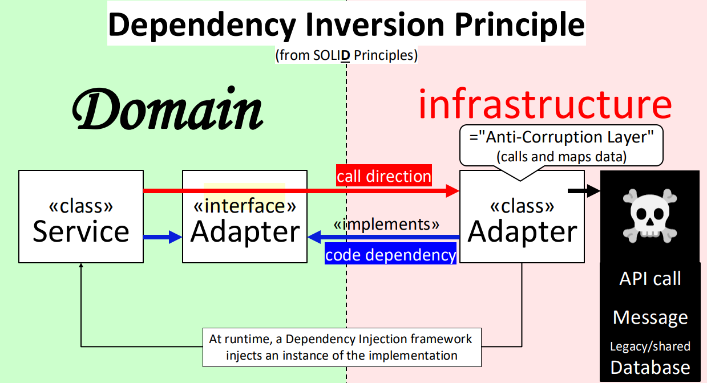
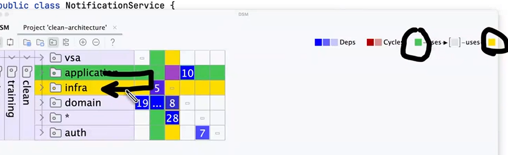
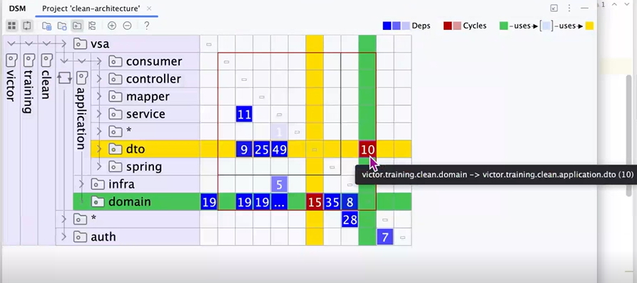
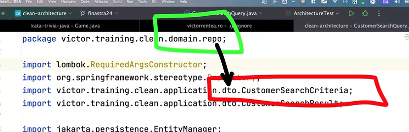
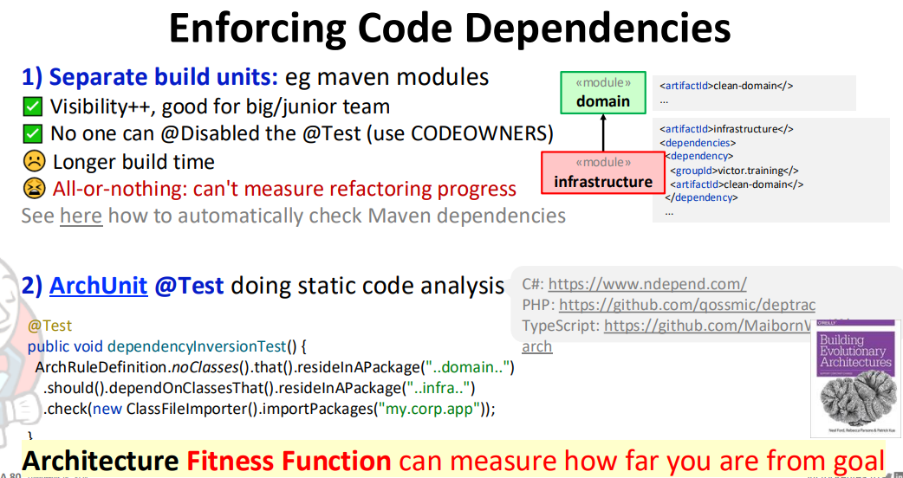
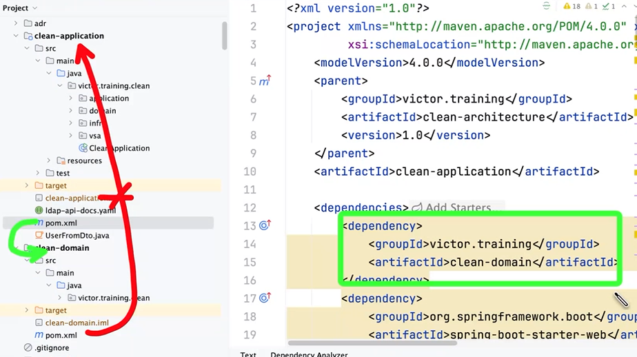
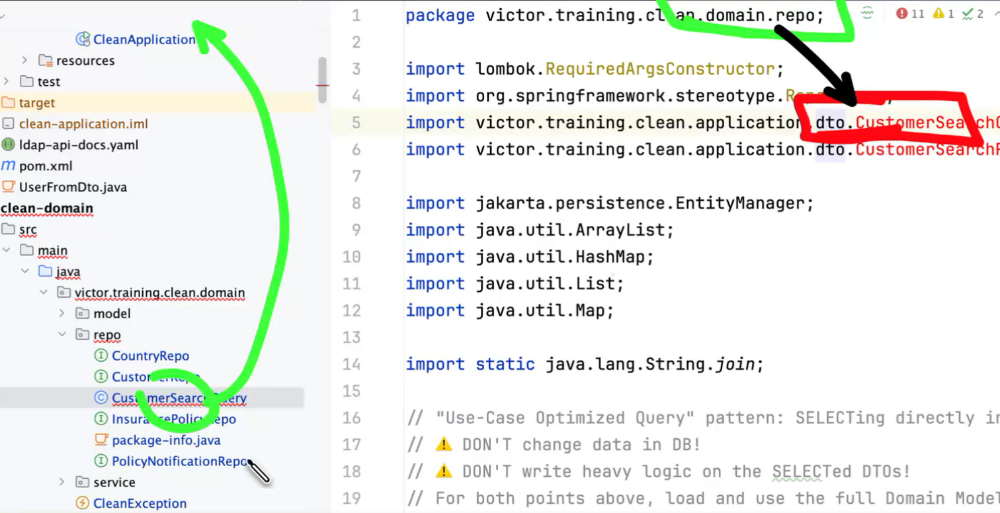

-- missed record lectures
day2
01:12:00
2:25:00

--name convention method in the service layer prefixed with:
get = in memory stuff,
fetch = from the outside API
find = from the database
--but it can also mislead if someone doesn't follow this, than it can be mentioned in ADR,  "we should this when we..."

--CODEOWNERS file in the root of the repo to define who should review the PRs

Day 2 - Dependency Inversion Principle
--The Dependency Inversion Principle (DIP) is a software design principle that states that high-level modules should not depend on low-level modules. Both should depend on abstractions.
Protecting the domain using technique (enforce boundary) that nothing from outside (infra) would ever be referenced directly from inside.
Domain starts to become Agnostic
At runtime , a Dependency Injection framework will inject an instance of the implementation of the interface adapter into the constructor of the domain service.
--Domain Service should not know about the implementation of the interface adapter, it should only know about the interface adapter.
Infrastructure = "Anti-corruption layer" (adapter) between the domain and the outside world (calls and maps data)

Menu -> Code -> Analyze Code -> Dependency Structure Matrix - DSM (shows the dependencies between the packages)
--The DSM is a tool that helps you understand the dependencies between the packages in your project. It shows you the dependencies between the packages in a matrix format. 
The rows and columns of the matrix represent the packages in your project. 
The cells of the matrix represent the dependencies between the packages. 

Find Cycle Dependencies 
APP -> DOM (10)-> DOM -> APP (200>)
red = bad victim (who depend on red?)  the domain should not depend on the app

repository is depended on app 10 times
repository works with DTOS !! WTF !  

Enforcing Code Dependencies
--ArchUnit is a Java library for checking the architecture of your Java code. It's a tool that helps you enforce the architecture of your code.

We have two Modules clean-application and clean-domain (empty)
--We have a rule that the domain should not depend on the application
--so the domain pom.xml should not have a dependency on the application,but the application can have a dependency on the domain

compiler error when moving out the domain to new model  

using separate build units (in eg a multi-module maven/gradle proj) to enforce boundaries between logical components.
= traditional way
+ code fails to compile on violations
+ everyone understands= clear structs
- Binary decision (all or nothing). Impossible to use if having 1000+ violations of that boundary you want to enforce in legacy code